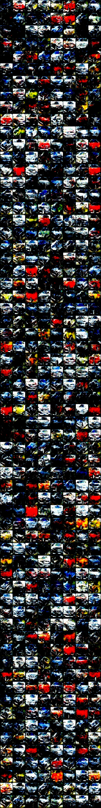

# DCGAN-Pytorch
Pytorch Implementation of DCGAN on Stanford Car dataset.

## Dependencies:

[Pytorch](https://github.com/pytorch/pytorch) 1.0

[Matplotlib](https://matplotlib.org/) 

[Opencv-Python](<https://pypi.org/project/opencv-python/>)

## How to run:

Directly check the CGAN.ipynb using [Jupyter notebook](<https://jupyter.org/>).

## Results

### 1500 epochs

## Description

### Optimizer

For optimizer, we used Adam(0.0002(*2e-4*), 0.5, 0.999) for both G and D in the early stage(0- 500 epoch).

(500-1000 epoch) same Adam configuration for both G and D except learning rate scaled down to 0.0001(*1e-4*).

After 1000 epoch, we used SGD for both G and D, with learning rate scaled down to 0.00002(*2e-5*)

### Loss Function

We used MSE Loss, based on this [paper](https://arxiv.org/abs/1611.04076).

